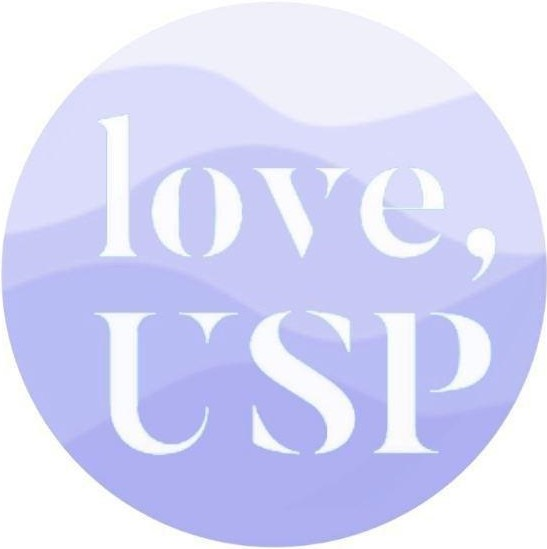

# Anonymous by Love, USP



Anonymous was created to create a safe space for USP students to hold meaningful conversations about mental health.
This simulates a group chat where students can share experience or advice, while remaining completely anonymous.
The telegram bot can be accessed [here](https://telegram.me/anongroupbetabot).

:warning: This bot was disabled as of 17 April 2021. Contact @kwokyto on Telegram for any enquiries.

## Features

When registered, any message that you sent to the bot will be sent to all other students that are also registered on the bot.
Your message would be accompanied by your username, allowing others to identify messages that are sent.
No other personal information would be shared with anyone in the group.

## General Commands

Below are a list of available commands for users that can be used in the Telegram bot.

### `/start`

Returns a general welcome message.

### `/about`

Returns a bot description, along with the sign up link, FAQ link, and admins’ Telegram handles.

### `/register <NUSNET ID> <password>`

Registers the student into the Anonymous system.
After being registered, students can send and receive messages.
The password is specific to each student, and will be provided by Love, USP admin.

### `/username`

Shows the student's username.

### `/leave`

Unregisters the student from the Anonymous system.
Afterwards, students will no longer be able to receive messages that are sent.
All details of the student that are stored in the Anonymous system would also be deleted.

## Admin Commands

These commands should only be made known to the admin to prevent misuse.

### `/delete <NUSNET ID> <password>`

Unregisters the user with a certain NUSNET ID.
This is to ensure that admins can easily remove any user that may be causing distress in the chat.
The password used here is different from the password used in `/register`, and should only be known by the admin.

## FAQs

The FAQ for the bot can be found [here](https://www.tinyurl.com/loveuspbotfaq "Love USP Bot FAQs")

## Debugging

The following outlines the procedure for debugging.

1. In dynamo_call.py, insert admin chat ID in `debugging_mode()` function.
2. In handler.py, uncomment line to enable debugging mode.
3. Open command line and `serverless deploy`.
4. From now on, non-admins who send messages to the bot will receive an "under maintenance" message.
5. Only admin can use `/broadcast_debug`, to send an "under maintenance" message to all users.
6. Admin can continue testing the bot as a normal user while under debug mode.
7. To flush the message queue, set `flush = True` in handler.py and `serverless deploy`.
8. After debugging, comment line in handler.py for disable debugging mode.
9. In Telegram, send `/allok <password>` to send an "all ok" message to all users.

## AWS and Serverless Deployment

### Installing

```lang-none
# Open the command window in the bot file location

# Install the Serverless Framework
$ npm install serverless -g

# Install the necessary plugins
$ npm install
```

### Deploying

```lang-none
# Update AWS CLI in .aws/credentials

# Deploy it!
$ serverless deploy

# With the URL returned in the output, configure the Webhook
$ curl -X POST https://<your_url>.amazonaws.com/dev/set_webhook
```

### AWS Configurations

1. From the AWS Console, select AWS Lambda.
2. In AWS Lambda, select "anon-group-bot-dev-webhook".
3. Select "Permissions" and select the Lambda role under "Execution role"
4. In AWS IAM, select "Attach policies" under "Permissions" and "Permissions policies"
5. Search for and select "AmazonDynamoDBFullAccess" and "Attach policy"
6. Run the Telegram bot with `/start` and register with `/register`
7. The first attempt at registration should return an error.
8. From the AWS Console, select AWS DynamoDB.
9. Under "Tables", ensure that the "AnonChatTable" table has been created.
10. Re-register with `/register`, and registration should be successful.

## Future Developments

- Improved welcome message to assist the registration process and what to expect and do next
